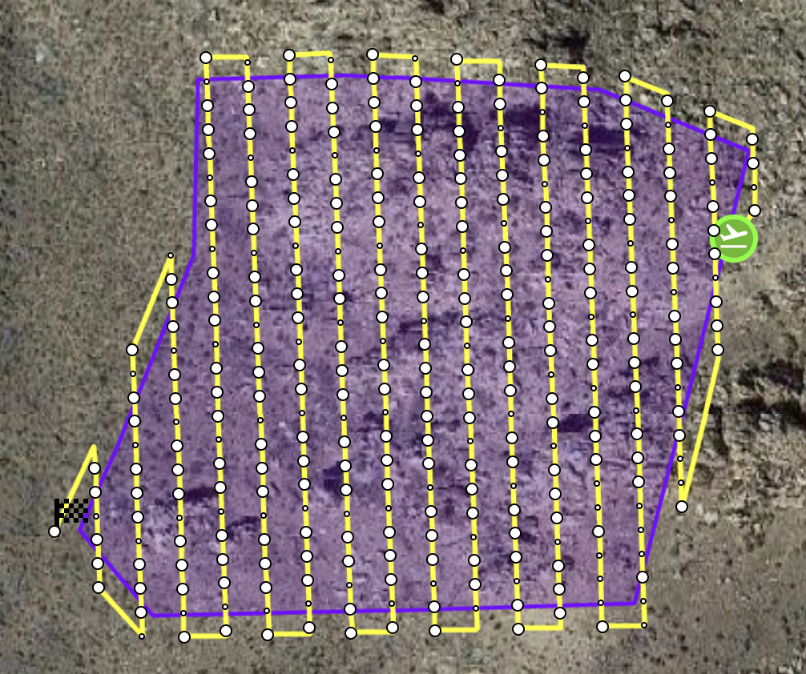
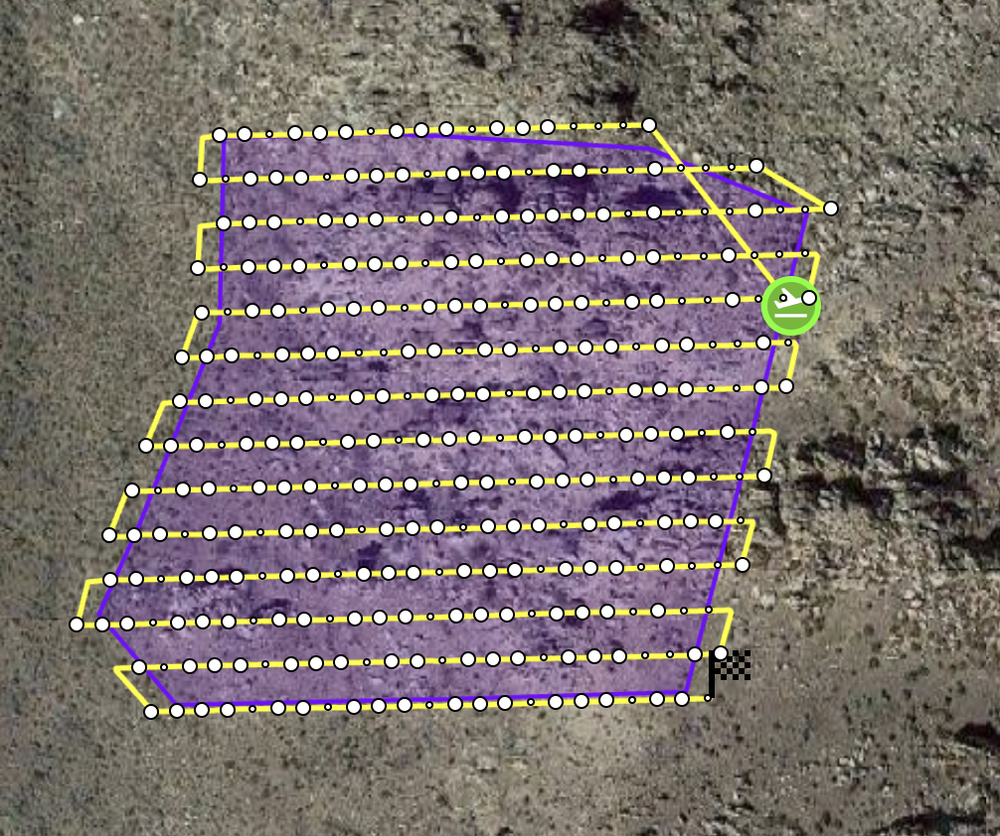
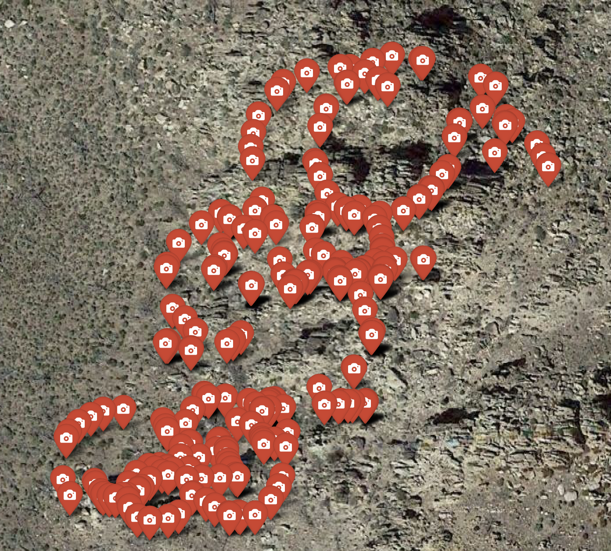

# Data Acquisition

## Equipment Used

- **UAV**: DJI Air 2S drone platform
- **GPS Equipment**: Trimble GeoXH (2008 series) with external Zephyr 2 antenna
- **Mobile LiDAR**: 
  - iPhone LiDAR scanner
  - GeoSlam system with Trimble Catalyst DA2 antenna
- **Photography**: iPhone camera system

## Field Survey: October 23, 2023

### Mission A
- **Flight altitude**: 30 m above terrain
- **Images captured**: 801 photographs
- **Sensor orientation**: Nadir-facing camera
- **Flight pattern**: Systematic grid pattern
- **Overlap specifications**: 
  - Front overlap: 70%
  - Lateral overlap: 65%

### Mission B  
- **Flight altitude**: 30 m above terrain
- **Images captured**: 632 photographs
- **Sensor orientation**: Nadir-facing camera
- **Flight pattern**: Systematic grid pattern
- **Overlap specifications**:
  - Front overlap: 70%
  - Lateral overlap: 65%

## Field Survey: August 21, 2025

### Mission North-South 90 (Nadir)
- **Flight altitude**: 17 m above terrain
- **Max flight speed** (horizontal): 3 m/s
- **Images captured**: 334 photographs
- **Sensor orientation**: Nadir-facing camera
- **Flight pattern**: Lawnmower
- **Overlap specifications**:
  - Front overlap: 70%
  - Lateral overlap: 65%
  - Margin: 5 m

### Mission North-South 45N (Oblique North)
- **Flight altitude**: 17 m above terrain
- **Max flight speed** (horizontal): 3 m/s
- **Images captured**: 361 photographs
- **Sensor orientation**: 45° oblique angle, facing north
- **Flight pattern**: Lawnmower
- **Overlap specifications**:
  - Front overlap: 70%
  - Lateral overlap: 65%
  - Margin: 5 m

### Mission North-South 45S (Oblique South)
- **Flight altitude**: 17 m above terrain
- **Max flight speed** (horizontal): 3 m/s
- **Images captured**: 331 photographs
- **Sensor orientation**: 45° oblique angle, facing south
- **Flight pattern**: Lawnmower
- **Overlap specifications**:
  - Front overlap: 70%
  - Lateral overlap: 65%
  - Margin: 5 m

### Mission West-East 90 (Nadir)
- **Flight altitude**: 17 m above terrain
- **Max flight speed** (horizontal): 3 m/s
- **Images captured**: 392 photographs
- **Sensor orientation**: Nadir-facing camera
- **Flight pattern**: Lawnmower
- **Overlap specifications**:
  - Front overlap: 70%
  - Lateral overlap: 65%
  - Margin: 5 m

  

### Mission West-East 45W (Oblique West)
- **Flight altitude**: 17 m above terrain
- **Max flight speed** (horizontal): 3 m/s
- **Images captured**: 386 photographs
- **Sensor orientation**: 45° oblique angle, facing west
- **Flight pattern**: Lawnmower
- **Overlap specifications**:
  - Front overlap: 70%
  - Lateral overlap: 65%
  - Margin: 5 m

  ### Mission West-East 45E (Oblique East)
- **Flight altitude**: 17 m above terrain
- **Max flight speed** (horizontal): 3 m/s
- **Images captured**: 382 photographs
- **Sensor orientation**: 45° oblique angle, facing east
- **Flight pattern**: Lawnmower
- **Overlap specifications**:
  - Front overlap: 70%
  - Lateral overlap: 65%
  - Margin: 5 m

  ### Mission West-East 33N (Oblique North)
- **Flight altitude**: 17 m above terrain
- **Max flight speed** (horizontal): 3 m/s
- **Images captured**: 376 photographs
- **Sensor orientation**: 33° oblique angle, facing north
- **Flight pattern**: Lawnmower
- **Overlap specifications**:
  - Front overlap: 70%
  - Lateral overlap: 65%
  - Margin: 5 m

  ### Mission West-East 33S (Oblique South)
- **Flight altitude**: 17 m above terrain
- **Max flight speed** (horizontal): 3 m/s
- **Images captured**: 386 photographs
- **Sensor orientation**: 33° oblique angle, facing south
- **Flight pattern**: Lawnmower
- **Overlap specifications**:
  - Front overlap: 70%
  - Lateral overlap: 65%
  - Margin: 5 m

### Manual
- **Images captured**: 334 photographs
  

